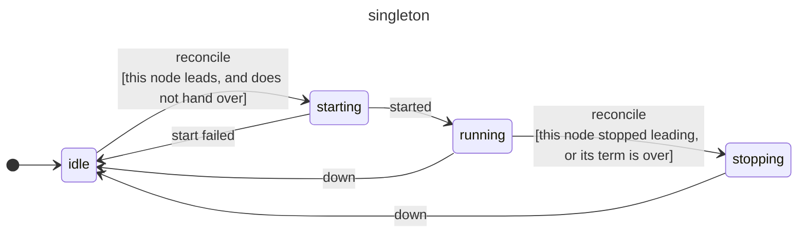
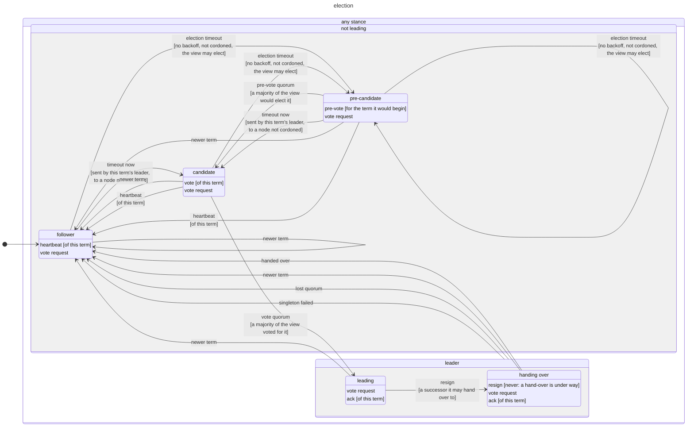
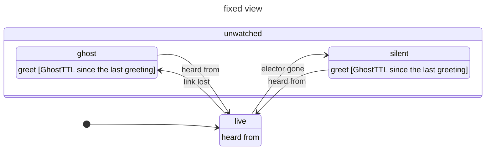
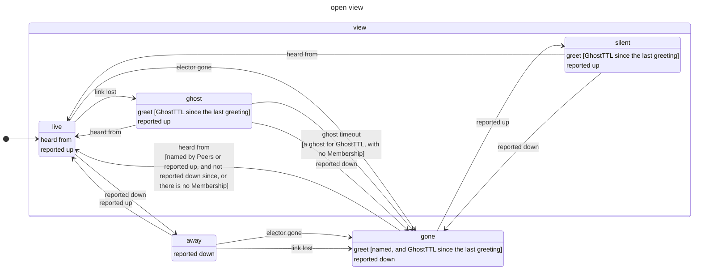

# grpcproc/leader

Leader election for [grpcproc](https://floatdrop.github.io/grpcproc/), and a
singleton that runs on the leader only, carrying its state from one leader to
the next. A package of grpcproc's, built on its public API alone.

```sh
go get github.com/floatdrop/grpcproc # leader is a package of the core module
```

```go
leader.Start(node, leader.Spec[*schedpb.State]{
    Cluster: "scheduler",
    Voters:  []string{"a", "b", "c"},
    Singleton: func(l *leader.Lease[*schedpb.State], last *schedpb.State) (actor.ChildSpec, error) {
        return actor.Child("scheduler", func() *Scheduler { return &Scheduler{lease: l, state: last} }), nil
    },
})

// on any node that takes part: the singleton, wherever it runs
resp, err := leader.Call[*schedpb.Scheduled](ctx, node, "scheduler", "scheduler", &schedpb.Schedule{…})
info, err := leader.Status(ctx, node, "scheduler") // Role, Term, Leader, View, Singleton, Cordoned
```

## Leadership is the singleton's lifetime

A node that wins an election starts the singleton, an `actor.ChildSpec` like
any other, and a node that stops leading tells it to exit with reason
`demoted`. Its `Init` is "became leader", its context ending is "stopped
being leader", and no handler asks whether it still leads. Its name is
registered on the leader's node only, so a call to it on a node that does not
lead fails with `grpcproc.ErrNoProc`; `Status` says where it runs.

A singleton that exits by itself, or cannot start, ends its node's leadership:
the node steps down and campaigns again only after a backoff that doubles with
each failure in a row, while the others elect one of themselves. So a failing
singleton moves across the cluster rather than restart in place; for restarts
in place, make it an `actor.ChildSupervisor`.

`Spec.Confirm` runs after a win and before the singleton starts: an error
withholds leadership, with the same backoff. It is where leadership waits for
an external lock.

On each node the singleton is idle until the node leads, and is stopped once
the node stops leading, hands over, or its term is over; one still starting is
stopped once it has started:

<!-- diagram: singleton -->


## The election

One elector process per node, registered as `leader/<cluster>`, under a
supervisor that `leader.Start` returns (or `leader.Child` puts in a tree of
yours). It is Raft's election without the log:

- **Terms** order leaderships. A candidate starts a term and asks for votes;
  a node votes once per term; a majority makes a leader, which asserts itself
  with heartbeats every `HeartbeatInterval` (50ms). A follower that hears
  none for an `ElectionTimeout` (150ms, randomized up to twice that)
  campaigns.
- **Pre-votes** come first: a node asks whether it would win before it starts
  a term, so one cut off from the others does not raise its term alone and
  depose the leader when it is back. A candidate whose election times out
  pre-votes again rather than start another term. The node a leader hands
  over to (`Resign`, `Transfer`, or a `Cordon` of the leader) skips the
  pre-vote, even one already pre-voting.
- **A leader steps down** once it has not heard from a majority for two
  election timeouts; a leader cut off from the others stops acting as one.
- **Followers stick** to a leader they heard from within an election timeout,
  ignoring vote requests, unless the leader handed over (`Resign`,
  `Transfer`, `Cordon`).
- **Sends go through a relay process per peer**, which also monitors the
  peer's elector: a send or monitor that waits for a dial to a node that does
  not answer holds that relay, never the elector and its heartbeats.

The elector is three state machines, declared with
[fsm](https://github.com/floatdrop/fsm): its stance in the election
(`role.go`), the singleton's phase (`singleton.go`, drawn above), and each
peer's standing in its view (`peers.go`, drawn below). The diagrams are drawn
from those declarations, and a test keeps them current. A stance's own lines
are the events it takes without moving: every stance answers vote requests,
and a newer term makes any of them a follower. `Status` reports a
pre-candidate as it reports a follower, and a leader handing over as the
leader:

<!-- diagram: election -->


### Who votes

With `Voters`, the view is that fixed set of nodes and a majority of it elects,
whether the others are up or not. Two majorities of one set share a node, so a
partition never elects two leaders. That is the default to reach for.

Without `Voters`, the view is dynamic: this node, `Peers`, and the nodes
`Membership` reports up (with `Membership`, only those; without it, also any
node that talks to this one). Left unset, `Membership` is the node's own
`Config.Membership`, if it has one. No leader is elected in a view smaller than
`MinClusterSize` (3). The relays' monitors keep it current:

| The peer's elector | The peer |
| --- | --- |
| exits (`shutdown`, a crash) or never ran (`noproc`) | leaves the view at once |
| cannot be reached (`noconnection`) | stays, as a ghost, until `Membership` reports it gone, or for `GhostTTL` (5s) without `Membership` |
| is heard from again | is back, unless `Membership` reported it down: then only its report of it up brings it back |

A dynamic view trades safety for availability: nodes whose views differ can
each count a majority of their own.

In the elector, a peer in the view is live, a ghost (out of reach) or silent
(running no elector this node can see), and one out of it is away (reported
down by `Membership`, still watched) or gone. With `Voters` no peer leaves the
view:

<!-- diagram: fixed view -->


Without `Voters`:

<!-- diagram: open view -->


A leader's elector that exits (its node stops gracefully) is seen by every
follower's monitor at once, and they campaign without waiting out a timeout.

## State from one leader to the next

The singleton checkpoints its state through its `Lease`:

```go
err := lease.Checkpoint(ctx, state) // returns once a majority holds it
lease.Save(state)                   // the same, without the wait
```

The leader sends it to the followers with its heartbeats, and a follower votes
only for a candidate whose state is at least as recent as its own: whichever
node leads next starts its singleton from every checkpoint that returned, or a
later one. Once the lease's term is over, `Checkpoint` fails with
`ErrNotLeader`, and nothing a deposed singleton saves reaches anyone.

`leader.Resign(ctx, node, cluster)` hands over on purpose: the leader stops its
singleton (whose `Terminate` can still checkpoint), waits for the follower with
the latest state to hold the leader's, and has it campaign at once. Call it
before stopping a leader's node, and the next leader starts from the
singleton's last word rather than its last checkpoint.

Keep the state to what the next leader needs to carry on: the jobs a scheduler
ran last, not a database. Every checkpoint carries all of it.

## Keeping it on disk

Without a `Store`, terms, votes and state live in memory. A cluster that loses
a majority of its nodes at once loses them, and so does a cluster of one at
every restart: its singleton starts from nothing, and its terms from zero
again. A restarted node, which may have voted before, votes only once it has
had time to hear from a leader.

```go
leader.Start(node, leader.Spec[*cronv1.State]{
    Cluster: "cron",
    Voters:  []string{"a", "b", "c"},
    Store:   leader.File("/var/lib/app/cron.election"), // this node's own
    Singleton: …,
})
```

With a `Store`, each node keeps its term, its vote and the state, as Raft
does. It saves them before anything that tells of them leaves its elector: a
vote, an acknowledgement of a checkpoint, a leader's own count of one, a
lease. A cluster that restarts whole starts its singleton from the last
checkpoint that returned, cordons included; its terms go on growing, so
`Lease.Term` stays a fencing token; and a restarted node votes at once, having
forgotten nothing. A `Save` that fails ends the elector, which its supervisor
starts again from what the `Store` holds; one that cannot be loaded keeps it
from starting.

`leader.File(path)` writes `path.tmp`, syncs it, renames it over `path`, and
syncs the directory, so a crash leaves the old state or the new one. Each node
needs a `Store` of its own, on its own disk. A shared one breaks the election,
and so does a file restored from a backup: it has forgotten votes it cast
since. Delete it instead, and the node starts afresh, as one without a `Store`
does.

The elector saves in its own loop, so a save holds up its heartbeats. It saves
at elections and checkpoints only, and a local SSD syncs in a millisecond or
so, but a disk that stalls for longer than `ElectionTimeout` (150ms) has the
followers campaign: leadership moves, safely, and for nothing. On a slower
disk, a cloud volume say, raise `ElectionTimeout`, and `HeartbeatInterval`
with it; etcd, which syncs the same way, defaults to 1s and 100ms.

The `Store` is a two-method interface, `Load` and `Save` of a few bytes, for
anything else that stays on the node.

## Calling the leader

```go
scheduled, err := leader.Call[*schedpb.Scheduled](ctx, p, "scheduler", "scheduler", &schedpb.Schedule{…})
```

calls the process registered as `scheduler` on whichever node leads
`scheduler`, from a node or from inside a process (`p`), and follows
leadership as it moves. It asks again, for as long as `ctx` allows, only when
the call cannot have reached the singleton:

| The call | Asked again? |
| --- | --- |
| no leader is known yet | yes |
| the node named has no such process: it no longer leads, or has not started its singleton yet | yes |
| never left this node: a `*grpcproc.LinkError` whose `Unsent` is set | yes |
| left, and its link broke, or `ctx` ended, while it waited | no: it may have been handled |
| was answered with an error | no: that is the answer |

Delivery is at most once, so the choice to repeat a call that may have been
handled is the caller's: fine for a read, or for a request the singleton
de-duplicates.
[`examples/singleton`](../examples/singleton/ids_test.go) has a singleton
that hands out numbers that never repeat, across a leader crash: each is
checkpointed before it is handed out, and callers on every node reach it
through `leader.Call`.

## Moving the leader, and taking a node out

```go
leader.Transfer(ctx, node, "scheduler", "b") // b leads next; "" for the most up-to-date follower
leader.Cordon(ctx, node, "scheduler", "c")   // c may not lead: for work on its host
leader.Uncordon(ctx, node, "scheduler", "c")
```

All three go to whichever node leads, found through `node`'s elector, from
any node that takes part. `Transfer` hands over as `Resign` does, to the node
named: the leader stops its singleton, waits for that follower to hold its
state, and has it campaign. It is refused for a node that leads already, is
not in the view, or is cordoned, and ends with `ErrNoSuccessor` if the
follower cannot be reached.

`Cordon` keeps a node from leading until `Uncordon`: it campaigns no more,
voters refuse it, and if it leads, it hands over. The cordoned nodes are part
of the state the leader replicates, and `Cordon` returns once a majority holds
it, so a cordon outlasts the cordoned node's restarts and the leader's too:
cordon a node, stop it, work on the host, start it again, and it stays a
follower until you uncordon it. A cordon that would leave no node of the view
to lead is refused. A cordoned node still votes, so a cluster keeps its
quorum while one is out.

A node that restarts holds no state, and voters refuse a candidate whose state
is older than theirs. So a voter that refuses one sends its own state with the
refusal, and the candidate campaigns again with it: a restarted node catches
up even when no leader is left to send it anything, as when every other node
is cordoned.

`Status` and the elector's inspect map list the cordoned nodes, and
[`grpcprocctl leader`](../tools/README.md#leader-elections) shows the election
as every node sees it, and moves the leader or cordons a node from a
terminal.

## Two leaders

Two nodes can briefly both believe they lead: a leader cut off from the others
leads until it notices, two election timeouts at most, while they elect
another. `Lease.Term` grows with every election: a resource that remembers the
highest term it has seen can refuse a deposed leader's writes.

## Observing it

The elector publishes through its inspect map what `grpcprocctl inspect`
shows: `role`, `term`, `leader`, `voted_for`, `view`, `quorum`,
`unreachable`, `state` (the version it holds), `cordoned`,
`checkpoints_waiting`, `singleton` and `backoff`. Its relays, starter and
membership watch are its children, labelled `leader relay`, `leader starter`
and `leader membership`.

## A job that runs once in a cluster

[grpcproc/cron](../cron/README.md) as the singleton: the cron process runs on
the leader, reports each job's last run as its state, and the next leader
resumes from it, catching up on what it missed within each job's
`StartingDeadline`.

```go
leader.Start(node, leader.Spec[*cronv1.State]{
    Cluster: "cron",
    Voters:  []string{"a", "b", "c"},
    Singleton: func(l *leader.Lease[*cronv1.State], last *cronv1.State) (actor.ChildSpec, error) {
        return cron.Child("cron", cron.Spec{Jobs: jobs, Resume: last, OnState: l.Save})
    },
})
```
